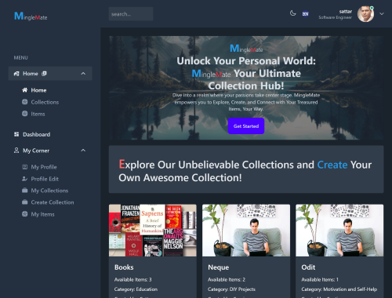

<a name="readme-top"></a>
# Server: https://github.com/AbdusSattar-70/MingleMate
<div align="center">
 <h3><b>MingleMate Client</b>.</h3>
</div>

<div align="center">
<h3><b>Screenshot</b></h3>

</div>

<!-- TABLE OF CONTENTS -->

# 📗 Table of Contents

- [📖 About the Project](#about-project)
  - [🛠 Built With](#built-with)
    - [Tech Stack](#tech-stack)
    - [Key Features](#key-features)
  - [🚀 Live Demo](#live-demo)
- [💻 Getting Started](#getting-started)
  - [Setup](#setup)
  - [Prerequisites](#prerequisites)
  - [Install](#install)
  - [Usage](#usage)
  - [Run tests](#run-tests)
  - [Deployment](#triangular_flag_on_post-deployment)
- [👥 Authors](#authors)
- [🔭 Future Features](#future-features)
- [🤝 Contributing](#contributing)
- [⭐️ Show your support](#support)
- [🙏 Acknowledgements](#acknowledgements)
- [📝 License](#license)

<!-- PROJECT DESCRIPTION -->

## 📖 MingleMate <a name="about-project"></a>

MingleMate is a mobile-first, responsive web application designed for efficient collection management. Catering to both non-authenticated and authenticated users, MingleMate ensures a seamless experience while maintaining privacy and access controls.

<!-- Features -->

## Key Features <a name="key-features"></a>

### Read-Only Access for Non-authenticated Users

- Non-authenticated users can explore the app with read-only access.
- They can utilize the search functionality but are restricted from creating collections, items, leaving comments, and likes.

### Access Control for Authenticated Not-Admins

- Authenticated users without admin privileges have comprehensive access to all features except the admin page.

### Admin Page for User Management

- Admins have access to the admin page for user management, including view, block, unblock, delete, add to admins, and remove from admins.
- Admins can even revoke their own admin access.

### Virtual Ownership for Admins

- Admins view all pages as if they are the authors, allowing them to manage any collection or item across the platform.

### Granular Permissions

- Only admins or creators of collections/items can manage them (edit, add, delete).
- Viewing is accessible to everyone except on the admin page.

### Full-Text Search

- Every page provides access to a full-text search.
- Search results always display items; if found in comments, the link leads to the item with comments.

### Personal User Page with Collection Management

- Users have a personal page to manage collections (create new, delete, or edit).
- Each collection links to a page containing a table of items with sorting, filtering, and item management capabilities.

### Tag System with Autocompletion

- All items have tags, supporting autocompletion.
- Dropdowns with tags are displayed based on user input.

### Comments and Likes

- Items have a linear comment system, automatically updated when someone adds a comment.

### Theme Support

- Two visual themes (light and dark) are available, with the user's choice saved.

### Below is the list of pages available in this app:

1. **Home Page**

   - **Path**: `/`
   - **Element**: `<Home />`
   - **Description**: The landing page of the application.

2. **User Profile Page**

   - **Path**: `/user-profile/:id`
   - **Element**: `<UserProfile />`
   - **Description**: Displays user profile information based on the provided user ID.

3. **Edit Profile Page**

   - **Path**: `/profile/edit`
   - **Element**: `<EditProfile />`
   - **Description**: Allows users to edit their profile information.

4. **All Collections Page**

   - **Path**: `/all-collections`
   - **Element**: `<CollectionsTable />`
   - **Description**: Displays a table of all available collections.

5. **User Collections Page**

   - **Path**: `/user-collections/:userId`
   - **Element**: `<UserAllColletions />`
   - **Description**: Displays collections owned by a specific user.

6. **Collection Details Page**

   - **Path**: `/display-single-collection/:id`
   - **Element**: `<CollectionDetails />`
   - **Description**: Displays details of a specific collection, including items.

7. **Create Collection Page**

   - **Path**: `/create-collection`
   - **Element**: `<CreateCollection />`
   - **Description**: Allows users to create a new collection.

8. **Edit Collection Page**

   - **Path**: `/edit-collection/:collection_id`
   - **Element**: `<EditCollectionForm />`
   - **Description**: Allows users to edit details of a specific collection.

9. **Create Item Page**

   - **Path**: `/create-item/:collection_id/create-item`
   - **Element**: `<CreateItem />`
   - **Description**: Allows users to create a new item within a specific collection.

10. **Edit Item Page**

    - **Path**: `/edit-item/:id/edit-item`
    - **Element**: `<EditItemForm />`
    - **Description**: Allows users to edit details of a specific item.

11. **User Items Page**

    - **Path**: `/user-items/:user_id`
    - **Element**: `<UserItemsTable />`
    - **Description**: Displays items owned by a specific user.

12. **All Items Page**

    - **Path**: `/get-items-all`
    - **Element**: `<AllItemsTable />`
    - **Description**: Displays a table of all available items.

13. **Item Details Page**

    - **Path**: `/get-single-item/:id`
    - **Element**: `<ItemDetailsNavigation />`
    - **Description**: Displays details of a specific item, including comments and likes.

14. **Sign Up Page**

    - **Path**: `/signup`
    - **Element**: `<SignUp />`
    - **Description**: Allows users to register a new account.

15. **Sign In Page**

    - **Path**: `/signin`
    - **Element**: `<SignIn />`
    - **Description**: Allows users to authenticate and log in.

16. **Admin Dashboard Page**

    - **Path**: `/admin-dashboard`
    - **Element**: `<PrivateRoute><Dashboard /></PrivateRoute>`
    - **Description**: Private route accessible only by authenticated users with admin privileges. Displays admin-related functionalities.

<p align="right">(<a href="#readme-top">back to top</a>)</p>

## 🛠 Built With <a name="built-with"></a>

## Tech Stack <a name="tech-stack"></a>

<details>
  <summary>Client</summary>
  <ul>
    <li>React</li>
    <li>TypeScript</li>
    <li>Tailwind</li>
    <li>And Some Libraries(you can find them at package.json file)</li>
  </ul>
</details>
<details>
  <summary>Server</summary>
  <ul>
    <li><a href=#>Server - Made with Rails Hosted on Render</a></li>
  </ul>
</details>

<details>
<summary>Database</summary>
  <ul>
    <li>PostgreSQL</li>
  </ul>
</details>

<!-- LIVE DEMO -->

## 🚀 Live Demo <a name="live-demo"></a>

- [Live Demo Link](https://mingle-mate.vercel.app/)

<p align="right">(<a href="#readme-top">back to top</a>)</p>

<!-- GETTING STARTED -->

## 💻 Getting Started <a name="getting-started"></a>

To get a local copy up and running, follow these steps.

## Prerequisites <a name="prerequisites"></a>

- In order to run this project you need:

### It would be best if you had some familiarity with `HTML`, `CSS`,`TS`, `React` and `Tailwindcss`.

- A Computer (MAC or PC)
- code editor (VSCode,Atom etc...)
- A browser (Chrome,Mozilla,Safari etc...)
- Version Control System (Git and Github)

# Setup <a name="setup"></a>

Clone this repository to your desired folder:

```bash
       git clone https://github.com/AbdusSattar-70/MingleMate_client.git
       cd MingleMate_client
```

# Install <a name="install"></a>

Install this project with:

```bash
     npm install
```

# Run the app <a name="run-the-app"></a>

```bash
   npm run dev
```

# Deployment <a name="triangular_flag_on_post-deployment"></a>

You can deploy this project using:

- Render Hosting server or GitHub pages

```bash
   npm install
   npm run build
```

<p align="right">(<a href="#readme-top">back to top</a>)</p>

<!-- AUTHORS -->

## 👥 Authors <a name="authors"></a>

## 👤 Abdus Sattar

- GitHub: [AbdusSattar-70](https://github.com/AbdusSattar-70)
- Twitter: [Abdus Sattar](https://twitter.com/Abdus_Sattar70)
- LinkedIn: [Abdus Sattar](https://www.linkedin.com/in/abdus-sattar-a41a26215/)

<p align="right">(<a href="#readme-top">back to top</a>)</p>

<!-- FUTURE FEATURES -->

## 🔭 Future Features <a name="future-features"></a>

- **Improve web accessibility feature for all users**
- **Add Multilingual feature**

<p align="right">(<a href="#readme-top">back to top</a>)</p>

<!-- CONTRIBUTING -->

## 🤝 Contributing <a name="contributing"></a>

Everybody is welcome to suggest, changes,Contributions, issues, and feature request in this project.

In order to do it, fork this repository, create a new branch and open a Pull Request from your branch.

Feel free to check the [issues page](../../issues/).

<p align="right">(<a href="#readme-top">back to top</a>)</p>

<!-- SUPPORT -->

## ⭐️ Show your support <a name="support"></a>

If you like this project, Please give me ⭐️ and you can use it following [MIT](./LICENSE) license.

<p align="right">(<a href="#readme-top">back to top</a>)</p>

<!-- ACKNOWLEDGEMENTS -->

## 🙏 Acknowledgments <a name="acknowledgements"></a>

I extend my heartfelt 💖 gratitude to the Itransition team, with a special appreciation for my favorite moderator and supervisor, Pavel Sir. Their unwavering support and guidance provided me with invaluable opportunities to delve into coding, embracing best practices for creating exceptional user experiences. Thank you for the inspiration and encouragement on this coding journey. 😍 Special thanks to all of my peers for their camaraderie and collaborative spirit.

<p align="right">(<a href="#readme-top">back to top</a>)</p>

<!-- LICENSE -->

## 📝 License <a name="license"></a>

This project is under [MIT](./LICENSE) licensed.

<p align="right">(<a href="#readme-top">back to top</a>)</p>
